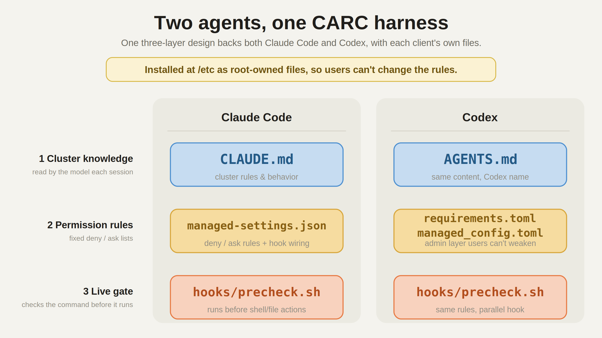
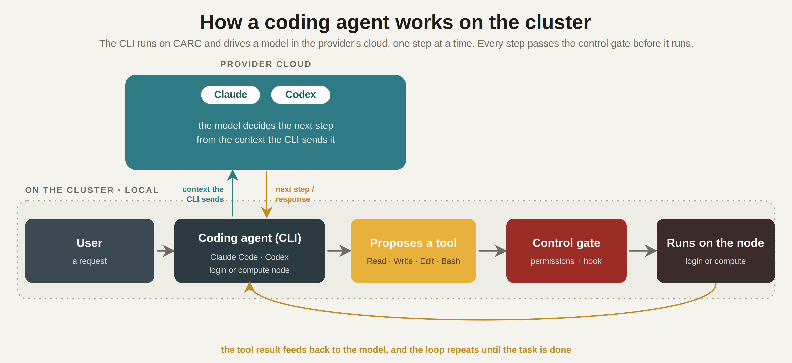

# CARC Harness for AI Coding Agents

Guardrails for **Claude Code** and **Codex** to work on the USC CARC HPC systems, **Discovery** and **Endeavour**. The harness gives each agent the cluster's operating rules, a set of managed permissions, and a live check that runs before shell and file actions, so researchers can use these tools without disrupting a shared system. It is built for CARC, but the same design can be adapted to other similar HPC systems.

A short write-up for researchers is on the CARC blog: *link coming soon*.

<p align="center"></p>

## What it is

Three layers, shipped for both agents under each client's own file names:

- **Cluster rules the model reads** — `CLAUDE.md` (Claude Code) / `AGENTS.md` (Codex). CARC-specific knowledge the model would not get from general training: where each filesystem lives and what it is for, quotas, login versus compute nodes, the module system, how to check a Slurm account and partition, and which files to stay away from.
- **Managed permission rules** — `managed-settings.json` (Claude Code) / `requirements.toml` + `managed_config.toml` (Codex). Fixed allow, ask, and deny lists, with bypass mode turned off.
- **A live hook** — `hooks/precheck.sh`. Runs before the shell and file actions the agent proposes, returns block / ask / allow, and writes an audit log. Claude Code and Codex use parallel versions of the script.

Together they cover destructive commands, credential-shaped files, other groups' shared storage, login-node compute, and job submission.

## How it works

<p align="center"></p>

The CLI runs on the cluster under your account and drives the model in the provider's cloud one step at a time. Each proposed action passes the permission rules and the hook before it runs on a node.

## Layout

```text
.
|-- claude/
|   |-- CLAUDE.md
|   |-- managed-settings.json
|   |-- hooks/precheck.sh
|   `-- INSTALL.md
`-- codex/
    |-- AGENTS.md
    |-- requirements.toml
    |-- managed_config.toml
    |-- hooks/precheck.sh
    `-- INSTALL.md
```


## Install (root, the real boundary)

On CARC this is already deployed at `/etc` on the **Discovery** and **Endeavour** login and compute nodes, so CARC users install nothing.

To deploy it on a node where you have root, `cd` into `claude/` or `codex/` and follow that directory's `INSTALL.md`. The root install places the files under `/etc/claude-code/` or `/etc/codex/`, where the managed-only flags (bypass off, no user-added permissions or hooks) actually take effect.

## Running it without root

On a machine where you do not have root, follow the same `INSTALL.md` steps without `sudo`, copying the files into your home directory (`~/.claude` or `~/.codex`) instead of `/etc`. You get the same guidance and checks.

## Feedback

Report anything that blocks legitimate work, or any confusing message, to [carc-support@usc.edu](mailto:carc-support@usc.edu).
